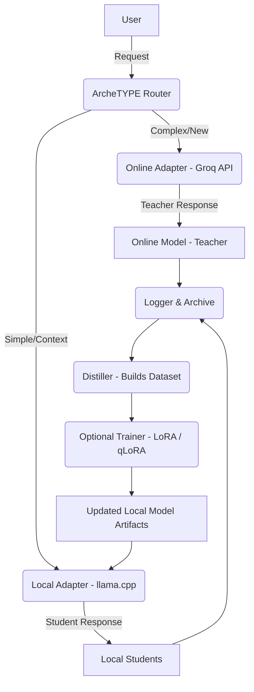

# ArcheTYPE Core (Initial Seed)

Welcome to the foundational repository for **ArcheTYPE**—a self-optimizing, hybrid AI router and language model system.

ArcheTYPE is designed to leverage the power of high-performance online APIs (the **Teacher**) while continuously improving efficient, local student models (the **Students**). This initial seed contains the first-step implementation artifacts, created by ArcheTYPE itself, setting the stage for autonomous development.

## 🚀 The ArcheTYPE Vision

ArcheTYPE aims to achieve the **best of both worlds** in AI deployment:

1.  **High-Fidelity Responses:** Utilizing a powerful online LLM (the Teacher) for complex, high-stakes, or novel queries.
2.  **Low-Latency & Privacy:** Routing common, contextual, or constrained queries to highly optimized, local student models.
3.  **Autonomous Improvement:** Using the Teacher's knowledge to perpetually distill, train, and refine the local Students, moving towards independent, efficient performance.

## 🏗️ Core Architecture Overview

The system operates as a **Smart Router** that dynamically delegates tasks and closes the loop on knowledge transfer. The architecture is detailed below:

